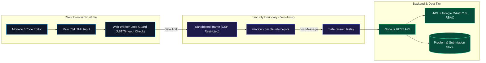
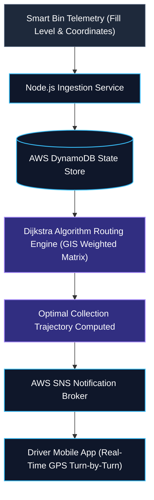

  

  

<!-- Quick Action Badges -->

  
  
  
  
  
  

  

---

<!-- ==================== ENGINEERING SCORECARD ==================== -->
<h3 align="center">📊 Quantitative Engineering Scorecard</h3>

<table width="100%" border="0" align="center">
  <tr>
    <td align="center" width="20%" style="padding: 16px; background: #0b1120; border: 1px solid #1e293b; border-radius: 10px;">
      <h1 style="color: #38bdf8; margin: 0; font-size: 32px;">1910</h1>
      <strong style="color: #f1f5f9; font-size: 13px;">LeetCode Peak Rating</strong> 
      Top 4.86% Globally &bull; Knight Badge
    </td>
    <td align="center" width="20%" style="padding: 16px; background: #0b1120; border: 1px solid #1e293b; border-radius: 10px;">
      <h1 style="color: #38bdf8; margin: 0; font-size: 32px;">1,420+</h1>
      <strong style="color: #f1f5f9; font-size: 13px;">Algorithmic Solutions</strong> 
      LeetCode + CodeChef + Codeforces
    </td>
    <td align="center" width="20%" style="padding: 16px; background: #0b1120; border: 1px solid #1e293b; border-radius: 10px;">
      <h1 style="color: #22c55e; margin: 0; font-size: 32px;">9.37</h1>
      <strong style="color: #f1f5f9; font-size: 13px;">Academic CGPA / 10</strong> 
      B.E. CSE @ CIT Chennai
    </td>
    <td align="center" width="20%" style="padding: 16px; background: #0b1120; border: 1px solid #1e293b; border-radius: 10px;">
      <h1 style="color: #38bdf8; margin: 0; font-size: 32px;">3★</h1>
      <strong style="color: #f1f5f9; font-size: 13px;">CodeChef Division 2</strong> 
      Max 1615 &bull; Starters 182 Rank 310
    </td>
    <td align="center" width="20%" style="padding: 16px; background: #0b1120; border: 1px solid #1e293b; border-radius: 10px;">
      <h1 style="color: #f59e0b; margin: 0; font-size: 32px;">Finalist</h1>
      <strong style="color: #f1f5f9; font-size: 13px;">AI ASCEND 2026</strong> 
      National 24h Hackathon (AWS/Kyndryl)
    </td>
  </tr>
</table>

 

<!-- ==================== INTERACTIVE TERMINAL ==================== -->
<table width="100%" border="0" align="center">
  <tr>
    <td style="background: #0d1117; border: 1px solid #30363d; border-radius: 10px; padding: 16px; font-family: 'Fira Code', 'Courier New', monospace;">
      ●&nbsp;●&nbsp;●
      rajesh@cit-chennai:~
        
      $ npx whoami rajesh-a --verbose
      <pre style="color: #c9d1d9; font-size: 13px; margin: 10px 0 0 0; line-height: 1.6;">
{
  "engineer": "Rajesh A",
  "location": "Chennai, Tamil Nadu, India",
  "status": "Available for SDE Internships &amp; Full-Time Opportunities",
  "academic_record": {
    "institution": "Chennai Institute of Technology",
    "degree": "B.E. Computer Science and Engineering (2023–2027)",
    "cgpa": "9.37 / 10"
  },
  "core_engineering_pillars": [
    "Zero-Trust Sandboxed Browser Runtimes (CSP, Web Workers)",
    "Event-Driven Cloud Backends (Node.js, AWS DynamoDB, SNS)",
    "Algorithmic Problem Solving (Knight @ LeetCode 1910 | Top 4.86%)",
    "Multi-Agent AI Orchestration (Google Gemini API &amp; Amazon APIs)"
  ]
}</pre>
    </td>
  </tr>
</table>

 

<!-- ==================== EXECUTIVE RECRUITER CHEAT SHEET ==================== -->
<table width="100%" border="0" align="center">
  <tr>
    <td style="padding: 18px; background: linear-gradient(135deg, #0f172a 0%, #1e1b4b 100%); border-left: 4px solid #38bdf8; border-radius: 8px;">
      <h4 style="margin: 0 0 10px 0; color: #38bdf8; font-size: 16px;">🎯 Executive Recruiter Brief &bull; Core Value Propositions</h4>
      <ul style="margin: 0; padding-left: 20px; color: #e2e8f0; line-height: 1.7; font-size: 13.5px;">
        <li><b>Proven Algorithmic Excellence:</b> <b>Knight Badge on LeetCode</b> (Peak: 1910, Top 4.86% globally, 867+ solved) and <b>3★ CodeChef</b>. Deep intuition for data structures, edge cases, and optimal space/time complexity.</li>
        <li><b>Defensive Security &amp; Systems Architecture:</b> Engineered <b>DevLab</b>, an isolated client-side code runner with CSP policy enforcement and Web Worker loop AST detection—mitigating common browser execution vulnerabilities.</li>
        <li><b>Distributed Cloud &amp; Real-Time Systems:</b> Designed high-throughput event-driven microservices using <b>Node.js</b>, <b>AWS DynamoDB</b>, and <b>AWS SNS</b> for sub-second IoT telemetry and graph recalculations.</li>
        <li><b>End-to-End Delivery &amp; Research:</b> Combined academic consistency (<b>9.37 CGPA</b>) with research internship publications in AI scientometrics &amp; predictive clinical modeling at CIT Chennai.</li>
      </ul>
    </td>
  </tr>
</table>

---

<!-- ==================== SYSTEM ARCHITECTURE BLUEPRINTS ==================== -->
<h2 align="center">🏗️ Visual System Architecture Blueprints</h2>

<i>Visualizing production-level architecture and security boundaries across flagship systems.</i>

### Blueprint 1: DevLab Sandboxed Browser Execution Pipeline

### Blueprint 2: Smart Waste AI Dynamic Graph Routing & Cloud Telemetry

---

<!-- ==================== ENGINEERING PHILOSOPHY ==================== -->
<h2 align="center">⚙️ Senior Engineering Pillars &amp; Design Principles</h2>

<table width="100%" border="0" align="center">
  <tr>
    <td width="25%" style="padding: 14px; background: #0b1120; border: 1px solid #1e293b; border-radius: 8px; vertical-align: top;">
      <h4 style="color: #38bdf8; margin: 0 0 6px 0;">🛡️ Defense-in-Depth</h4>
      

        Never trust untrusted client input. In <i>DevLab</i>, arbitrary code runs only in stripped iframes with CSP headers and Web Worker loop termination.
      

    </td>
    <td width="25%" style="padding: 14px; background: #0b1120; border: 1px solid #1e293b; border-radius: 8px; vertical-align: top;">
      <h4 style="color: #38bdf8; margin: 0 0 6px 0;">⚡ Algorithmic Rigor</h4>
      

        Every system begins with Big-O analysis. Applying Dijkstra on weighted spatial graphs reduces unnecessary municipal fuel consumption by double digits.
      

    </td>
    <td width="25%" style="padding: 14px; background: #0b1120; border: 1px solid #1e293b; border-radius: 8px; vertical-align: top;">
      <h4 style="color: #38bdf8; margin: 0 0 6px 0;">☁️ Decoupled Events</h4>
      

        Building systems that scale horizontally by separating ingestion, state storage (DynamoDB), and dispatch notifications (AWS SNS).
      

    </td>
    <td width="25%" style="padding: 14px; background: #0b1120; border: 1px solid #1e293b; border-radius: 8px; vertical-align: top;">
      <h4 style="color: #38bdf8; margin: 0 0 6px 0;">📈 Measurable Impact</h4>
      

        Continuous user instrumentation with GA4 and Clarity to validate conversion funnels and eliminate UI latency bottlenecks.
      

    </td>
  </tr>
</table>

---

<!-- ==================== FEATURED PROJECT SPOTLIGHT ==================== -->
<h2 align="center">🚀 Production Projects &amp; Architectural Deep Dives</h2>

<table width="100%" border="0" align="center">
  <tr>
    <td style="padding: 20px; background: #0b1120; border: 1px solid #1e293b; border-radius: 10px;">
      <h3 style="color: #38bdf8; margin: 0 0 8px 0;">1. DevLab &ndash; Cloud Front-End Coding Practice &amp; Evaluation Platform</h3>
      

        <i>A high-security, browser-based coding sandbox environment engineered to execute arbitrary user JavaScript/HTML code safely without compromising client security or server compute.</i>
      

      <table width="100%" border="0">
        <tr>
          <td width="33%" style="background: #0f172a; padding: 10px; border-radius: 6px;">
            <b style="color: #79c0ff; font-size: 12px;">Browser Sandboxing</b> 
            <small style="color: #94a3b8;">Strict CSP, stripped same-origin privileges &amp; postMessage console relay.</small>
          </td>
          <td width="33%" style="background: #0f172a; padding: 10px; border-radius: 6px;">
            <b style="color: #79c0ff; font-size: 12px;">Loop Guard Protection</b> 
            <small style="color: #94a3b8;">Web Worker runtime execution monitor halts infinite while/for loops.</small>
          </td>
          <td width="33%" style="background: #0f172a; padding: 10px; border-radius: 6px;">
            <b style="color: #79c0ff; font-size: 12px;">Full Auth &amp; REST APIs</b> 
            <small style="color: #94a3b8;">12-endpoint REST API, JWT tokens, Google OAuth 2.0 RBAC.</small>
          </td>
        </tr>
      </table>
       
      

        
      

    </td>
  </tr>
  <tr><td height="12"></td></tr>
  <tr>
    <td style="padding: 20px; background: #0b1120; border: 1px solid #1e293b; border-radius: 10px;">
      <h3 style="color: #38bdf8; margin: 0 0 8px 0;">2. AI Learning Path Generator</h3>
      

        <i>An AI-driven mentorship web application transforming ambitious learning goals into daily milestone roadmaps. Built with Next.js, TypeScript, and modern responsive design.</i>
      

      

        
        &nbsp;
        
      

    </td>
  </tr>
  <tr><td height="12"></td></tr>
  <tr>
    <td style="padding: 20px; background: #0b1120; border: 1px solid #1e293b; border-radius: 10px;">
      <h3 style="color: #38bdf8; margin: 0 0 8px 0;">3. Smart Waste Monitoring &amp; Route Optimization AI</h3>
      

        <i>AI-powered municipal logistics pipeline applying Dijkstra’s algorithm over GIS spatial networks to recalculate waste collection routes dynamically, synchronized via Node.js, AWS DynamoDB, and AWS SNS.</i>
      

      

        
      

    </td>
  </tr>
  <tr><td height="12"></td></tr>
  <tr>
    <td style="padding: 20px; background: #0b1120; border: 1px solid #1e293b; border-radius: 10px;">
      <h3 style="color: #38bdf8; margin: 0 0 8px 0;">4. BuySmart AI: Smart Procurement Multi-Agent System</h3>
      

        <i>Autonomous procurement platform powered by collaborative multi-agent architecture. Combines Google Gemini AI and Amazon APIs for vendor scorecards, automated purchase order creation, and invoice reconciliation.</i>
      

      

        
      

    </td>
  </tr>
</table>

---

<!-- ==================== COMPETITIVE PROGRAMMING ==================== -->
<h2 align="center">⚡ Competitive Programming &amp; Algorithmic Milestones</h2>

<i>Real-time live telemetry tracking algorithmic problem solving across competitive platforms.</i>

  

  
  
  
  

---

<!-- ==================== TECH STACK & COMPETENCY MATRIX ==================== -->
<h2 align="center">🛠️ Technical Competency &amp; Technology Stack</h2>

<table width="100%" border="0" align="center">
  <tr>
    <td width="50%" style="padding: 16px; background: #0b1120; border: 1px solid #1e293b; border-radius: 8px; vertical-align: top;">
      <h4 style="color: #38bdf8; margin: 0 0 10px 0;">💻 Core Languages &amp; Runtime</h4>
      

        
      

      <small style="color: #94a3b8;">C++ (DSA &amp; CP), Java (OOP &amp; Systems), Python (Data &amp; AI), TypeScript / JavaScript (Full-Stack).</small>
    </td>
    <td width="50%" style="padding: 16px; background: #0b1120; border: 1px solid #1e293b; border-radius: 8px; vertical-align: top;">
      <h4 style="color: #38bdf8; margin: 0 0 10px 0;">🌐 Frontend &amp; Client Architecture</h4>
      

        
      

      <small style="color: #94a3b8;">React.js, Next.js (SSR / SSG), Tailwind CSS, Browser Web Workers, Canvas, Responsive UI.</small>
    </td>
  </tr>
  <tr><td height="10"></td></tr>
  <tr>
    <td width="50%" style="padding: 16px; background: #0b1120; border: 1px solid #1e293b; border-radius: 8px; vertical-align: top;">
      <h4 style="color: #38bdf8; margin: 0 0 10px 0;">☁️ Backend, Distributed Cloud &amp; DB</h4>
      

        
      

      <small style="color: #94a3b8;">Node.js, Express, PostgreSQL, AWS (DynamoDB, SNS), Docker containerization, RESTful microservices.</small>
    </td>
    <td width="50%" style="padding: 16px; background: #0b1120; border: 1px solid #1e293b; border-radius: 8px; vertical-align: top;">
      <h4 style="color: #38bdf8; margin: 0 0 10px 0;">🔧 Engineering Tools &amp; Instrumentation</h4>
      

        
      

      <small style="color: #94a3b8;">Git, GitHub Actions, Postman API testing, n8n workflow automation, Google Analytics 4, Clarity.</small>
    </td>
  </tr>
</table>

---

<!-- ==================== GITHUB ANALYTICS & ACTIVITY ==================== -->
<h2 align="center">📈 GitHub Analytics &amp; Telemetry</h2>

  
  

  

  

<h2 align="center">Contribution Journey</h2>

  

---

<!-- ==================== EXPERIENCE & HONORS ==================== -->
<h2 align="center">💼 Experience &amp; Verified Honors</h2>

<table width="100%" border="0" align="center">
  <tr>
    <td width="50%" style="padding: 18px; background: #0b1120; border: 1px solid #1e293b; border-radius: 10px; vertical-align: top;">
      <h4 style="color: #38bdf8; margin: 0 0 10px 0;">💼 Industry &amp; Research Experience</h4>
      <ul style="color: #cbd5e1; font-size: 13px; line-height: 1.6; margin: 0; padding-left: 20px;">
        <li>
          <b>CIT Chennai &bull; Research Intern</b> <small style="color: #64748b;">(Nov 2024 &ndash; Dec 2024)</small> 
          Conducted scientometric AI/ML trends research, emotion recognition ML models &amp; healthcare clinical analytics.
        </li>
        <li style="margin-top: 10px;">
          <b>Kaizenspark Tech &bull; Full Stack Developer Intern</b> <small style="color: #64748b;">(Jul 2024 &ndash; Sep 2024)</small> 
          Engineered secure 1-to-many platform architecture; developed official portal with high-performance responsive UI.
        </li>
        <li style="margin-top: 10px;">
          <b>DNYX &bull; Digital Marketing Analysis Intern</b> <small style="color: #64748b;">(Aug 2024 &ndash; Oct 2024)</small> 
          Formulated user journey conversion funnels with GA4, Microsoft Clarity &amp; HubSpot analytics.
        </li>
      </ul>
    </td>
    <td width="50%" style="padding: 18px; background: #0b1120; border: 1px solid #1e293b; border-radius: 10px; vertical-align: top;">
      <h4 style="color: #38bdf8; margin: 0 0 10px 0;">📜 Verified Certifications &amp; Accolades</h4>
      <ul style="color: #cbd5e1; font-size: 13px; line-height: 1.6; margin: 0; padding-left: 20px;">
        <li>
          <b>AI ASCEND 2026 National Finalist</b> 
          24-hour National Hackathon by Saveetha Engineering, AWS &amp; Kyndryl.
        </li>
        <li style="margin-top: 10px;">
          <b>Hackathon Distinctions</b> 
          Top 27 @ College Level SDG Hackathon (500+ participants) &bull; Top 50 @ SunHacks (1,000+ participants).
        </li>
        <li style="margin-top: 10px;">
          <b>Professional Credentials</b> 
          Coursera: Data Structures &amp; Algorithms &bull; Cisco: CCNA 1&ndash;3 &amp; Cybersecurity &bull; NPTEL: DBMS, Cloud, Ethical Hacking &bull; Udemy: Adv. Web Dev, C++.
        </li>
      </ul>
    </td>
  </tr>
</table>

---

<!-- ==================== CONNECT & COLLABORATE ==================== -->
<h2 align="center">🤝 Let's Connect &amp; Collaborate</h2>

<i>Open to discussions on distributed systems, software engineering internships, algorithmic challenges, and innovative open-source projects.</i>

<table border="0" align="center">
  <tr>
    <td align="center" width="220" style="padding: 18px; background: #0b1120; border: 1px solid #1e293b; border-radius: 10px;">
      <a href="https://www.linkedin.com/in/rajesh-a-profile" target="_blank">
        
          
        
      </a>
       
      <b>Professional Network</b>
    </td>
    <td align="center" width="220" style="padding: 18px; background: #0b1120; border: 1px solid #1e293b; border-radius: 10px;">
      
        
      
       
      <b>Competitive Profiles</b>
    </td>
    <td align="center" width="220" style="padding: 18px; background: #0b1120; border: 1px solid #1e293b; border-radius: 10px;">
      <a href="mailto:rajesh180206@gmail.com">
        
          
        
      </a>
       
      <b>Direct Communication</b>
    </td>
  </tr>
</table>

 

  

